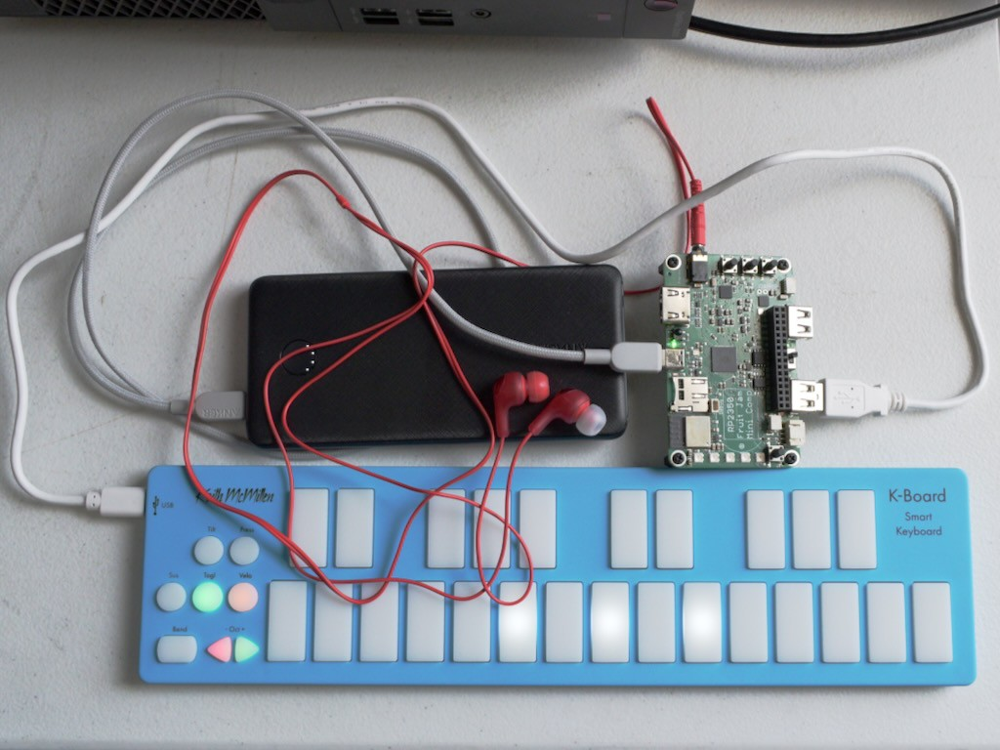

<!-- SPDX-License-Identifier: MIT -->
<!-- SPDX-FileCopyrightText: Copyright 2025 Sam Blenny -->
# Fruit Jam Portable MIDI Synth

This is a minimalist polyphonic square wave synth for Fruit Jam that's intended
for portable use with a USB power bank. The only output is audio to the board's
headphone jack. The only input is from a USB MIDI controller connected to the
board's USB host port. To set the volume, you can edit the code.

The main interesting thing about this project is that it demonstrates how to
make a CircuitPython synth with MIDI events coming from the USB host interface
rather than a USB device interface or UART MIDI. Also, this works as a good
stress test of the CircuitPython USB host stack in combination with audio
output using I2S and synthio.

This code was **originally** developed on CircuitPython **10.0.0-beta.0* with a
pre-release **rev B Fruit Jam**. But, now I've **updated** it for CircuitPython
**10.0.0-beta.3** with the the production **rev D Fruit Jam** board (I2S WS and
MCLK pins swapped, right channel of headphone output fixed).

## Known Issues

1. Stuck and Dropped Notes

   As I write this on July 26, 2025, running on CircuitPython 10.0.0-beta.0,
   this code produces stuck or dropped notes relatively often. I'm not sure
   about how it's happening, but my guess is it has to do with interactions in
   the CircuitPython core between interrupts for audio and the USB stack.

   If anybody feels inspired to dig into what's going on, please do! To
   reproduce the problem, just hook up a USB MIDI keyboard and bang away for a
   while. Within a minute or two you should get some stuck or dropped notes.

## Usage

The code for this project is meant to be installed onto the CIRCUITPY drive of
a Fruit Jam board by either using the `make sync` make target of this repo's
[Makefile](Makefile) or by manually copying the project bundle files (see
[releases page](https://github.com/samblenny/fruit-jam-portable-midi-synth/releases)
for project bundle zip file download link).

Important Configuration Notes:

1. The default DAC volume level is set to a safe (low) volume for earbuds. To
   get a line level output to use with a mixer, powered speaker, or other
   device with its own volume adjustment capability, you need to edit
   [code.py](code.py) to set a higher value for `dac.dac_volume` (see comments
   in source code).

2. You could easily modify the code to work with a Metro RP2350 with a TLV320
   DAC breakout board. To do that, you would change the `from board import ...`
   line at the top of code.py to match the pins you want to use. Then you would
   edit the audio initialization function do `audio = I2SOut(bit_clock=...)`
   with the correct pinout.

After Configuration:

1. Connect a powered speaker, mixer, or whatever to the headphone jack

2. Power the board

3. Plug a USB MIDI controller to the USB host port

4. Wait a few seconds for the USB MIDI device to be detected

5. Play some notes

Troubleshooting:

If the above steps don't work for you, you can try connecting to the Fruit Jam
board's serial console using a serial monitor program like PyCharm, Mu, tio, or
screen. On the serial console, check for status or error messages. If you try
to use a MIDI controller that requires the full 500 mA for USB 2.0, you might
have problems. In that case, you could try a powered USB hub or a USB OTG style
cable that splits power and data onto two different jacks.

## Suitable MIDI Controllers

For a portable battery powered setup, you'll want a MIDI controller that is
relatively small and that doesn't draw too much current. For discussion of the
pros and cons of various controllers, you can check forums like reddit or
modwiggler.

Based on my reading of forums, reviews, and manufacturer websites, I made the
list below with some controllers that might be suitable. I've only tried a
couple of these, but I've seen people online say that they like them (others
disagree). Keep in mind that 25 key keyboards have some inherent limitations,
caveat emptor, etc. Anyhow, in alphabetical order...

- Arturia MicroLab mk3
- Korg MicroKEY-25
- Korg NanoKEY2
- Korg NanoKEY Fold
- Korg NanoPAD2
- Muse Kinetics (Keith McMillen) K-Board C

## Suitable Speakers or Headphones

Currently, the code defaults to a low volume that works with earbuds. To adjust
the volume, you can edit the code.

1. I've mostly been testing with a line-level signal out of the Fruit Jam
   into a small desktop mixer to drive a pair of cheap JVC Gumy earbuds.

2. It also works to plug the earbuds directly into the board.

3. You could use a Bluetooth speaker with 3.5mm aux input jack. But, watch out
   for speakers with silly DSP features that add lots of latency (some speakers
   have high latency even on the aux jack, so check reviews).

4. You could use small computer speakers that have a 3.5mm audio plug and a USB
   plug for power. For this to work, you might want a USB power bank with two
   charging output ports (one for speakers, one for Fruit Jam).
